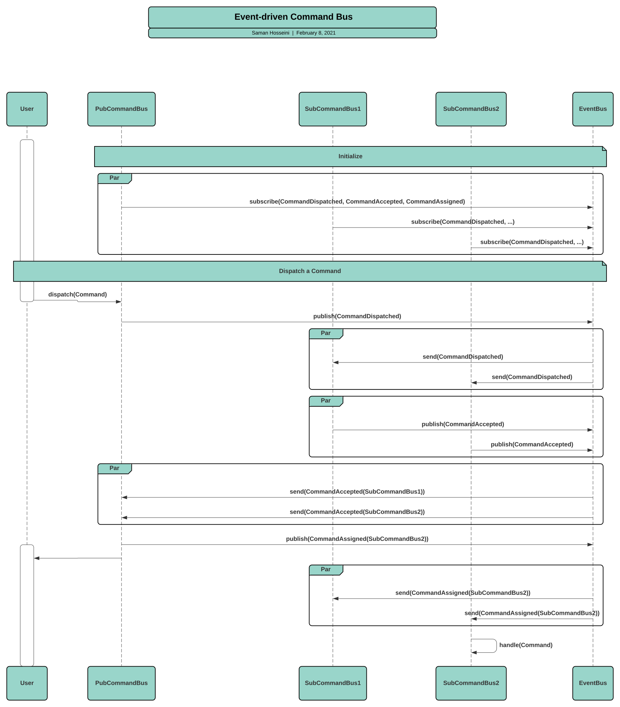
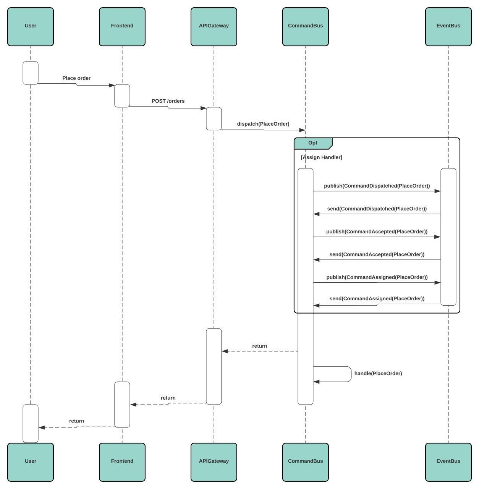

# Commands

## Calling Commands directly on the Aggregate

```go
// order.go

type Order struct {
    aggregate.Aggregate

    ItemID    uuid.UUID
    Quantity  int
    Customer  Customer
}

type Customer struct { ... }

func (o *Order) ApplyEvent(event.Event) { ... }

func (o *Order) Place(
    orderID, itemID uuid.UUID,
    quantity int,
    cus Customer,
) error {
    if quantity < 1 {
        return errors.New("illegal quantity")
    }
    o.event("order.placed", orderPlacedData{
        OrderID:  orderID,
        ItemID:   itemID,
        Quantity: quantity,
        Customer: cus,
    })
    return nil
}
```

```go
func placeOrder(aggregates aggregate.Repository) error {
    orderID := uuid.New()
    itemID := uuid.New()
    quantity := 3
    cus := Customer{}
    order := NewOrder(orderID)

    if err := aggregates.Fetch(context.TODO(), order); err != nil {
        return fmt.Errorf("fetch order: %w", err)
    }

    if err := order.Place(orderID, itemID, quantity, cus); err != nil {
        return fmt.Errorf("place order: %w", err)
    }

    if err := aggregates.Save(context.TODO(), order); err != nil {
        return fmt.Errorf("save order: %w", err)
    }

    return nil
}
```

## Dispatch Commands via the Command Bus

### Defining Commands

```go
// commands.go

const PlaceOrder = "order.place"

type PlaceOrderData struct {
    ItemID uuid.UUID
    Quantity int
}

func NewPlaceOrder(orderID, itemID uuid.UUID, quantity int) command.Command {
    return command.New(PlaceOrder, PlaceOrderData{
        ItemID:   itemID,
        Quantity: quantity,
    }, command.Aggregate("order", orderID))
}
```

### and use the Aggregate as the Command Handler

```go
// order.go

type Order struct {
    aggregate.Aggregate

    ItemID    uuid.UUID
    Quantity  int
    Customer  Customer
}

type Customer struct { ... }

func (o *Order) ApplyEvent(evt event.Event) {
    switch evt.Name() {
    case "order.place":
        return o.place(evt)
    }
}

func (o *Order) HandleCommand(cmd command.Command) error {
    switch cmd.Name() {
    case "order.place":
        return o.handlePlace(cmd)
    default:
        return nil
    }
}

func (o *Order) handlePlace(cmd command.Command) error {
    data := cmd.Data().(PlaceOrderData)

    if data.quantity < 1 {
        return errors.New("illegal quantity")
    }

    o.event("order.placed", orderPlacedData{
        OrderID:  orderID,
        ItemID:   itemID,
        Quantity: quantity,
        Customer: cus,
    })

    return nil
}

func (o *Order) place(evt event.Event) {
    data := evt.Data().(OrderPlacedData)
    o.ItemID = data.ItemID
    o.Quantity = data.Quantity
}
```

```go
// main.go

func placeOrder(aggregates aggregate.Repository, bus command.Bus) error {
    orderID := uuid.New()
    itemID := uuid.New()
    quantity := 3
    cus := Customer{}

    if err := bus.Dispatch(
        context.TODO(),
        NewPlaceOrder(orderID, itemID, quantity),
      ); err != nil {
        return fmt.Errorf("dispatch command: %w", err)
    }

    return nil
}
```

### and use a standalone Command Handler (idea #1)

```go
// order.go

type Order struct { ... }

func (o *Order) Place(
    itemID uuid.UUID,
    quantity int,
) error {
    if quantity < 1 {
        return fmt.Errorf("illegal quantity: %d", quantity)
    }
    o.event("order.placed", orderPlacedData{
        ItemID:   itemID,
        Quantity: quantity,
    }
    return nil
}

type commandHandler struct {
    aggregates aggregate.Repository
}

func (ch commandHandler) HandleCommand(
    ctx context.Contex,
    cmd command.Command,
) error {
    switch cmd.Name() {
    case "order.place":
        return ch.placeOrder(ctx, cmd)
    default:
        return nil
    }
}

func (ch commandHandler) placeOrder(ctx context.Context, cmd command.Command) error {
    ctx := cmd.Context()
    a, err := cmd.Aggregate(func(id uuid.UUID) aggregate.Aggregate {
        return NewOrder(id)
    })
    order := a.(*Order)
    if err := ch.aggregates.Fetch(ctx, order); err != nil {
        return fmt.Errorf("fetch order: %w", err)
    }

    data := cmd.Data().(orderPlacedData)

    if err := order.Place(data.ItemID, data.Quantity); err != nil {
        return fmt.Errorf("place order: %w", err)
    }

    if err = ch.aggregates.Save(ctx, order); err != nil {
        return fmt.Errorf("save order: %w", err)
    }

    return nil
}
```

### and use a standalone Command Handler (idea #2)

This Command Handler does not need to save the Aggregate back into the Event
Store. Persistence is handled by the Command Bus which calls the Handler.

```go
func CommandHandler() command.HandlerFunc {
    return func(ctx command.Context) error {
        cmd := ctx.Command()
        switch cmd.Name() {
        case "order.placed":
            return placeOrder(ctx)
        default:
            return nil
        }
    }
}

func placeOrder(ctx command.Context) error {
    cmd := ctx.Command()
    data := cmd.Data()
    order := ctx.Aggregate().(*Order)

    if err := order.Place(data.ItemID, data.Quantity); err != nil {
        return fmt.Errorf("place order: %w", err)
    }

    return nil
}
```

### and use the Command Bus for handling Commands

```
func main() {
    var ebus event.Bus
    var enc command.Encoder

    bus := cmdbus.New(enc, ebus)

    ctx, cancel := context.WithCancel(context.Background())
    defer cancel()

    commands, err := bus.Handle(context.TODO(), "foo", "bar", "baz")
    if err != nil {
	log.Fatalf("command bus: %w", err)
    }

    for cmd := range commands {
	log.Println(fmt.Sprintf("Command ID: %s", cmd.ID()))
	log.Println(fmt.Sprintf("Command Name: %s", cmd.Name()))
	// ...
    }


    // stop handling commands
    cancel()
}
```

## Command Bus

### How it works

<div style="background: #fff; border-radius: 8px; padding: 1rem;">



</div>

### Example

<div style="background: #fff; border-radius: 8px; padding: 1rem;">



</div>
