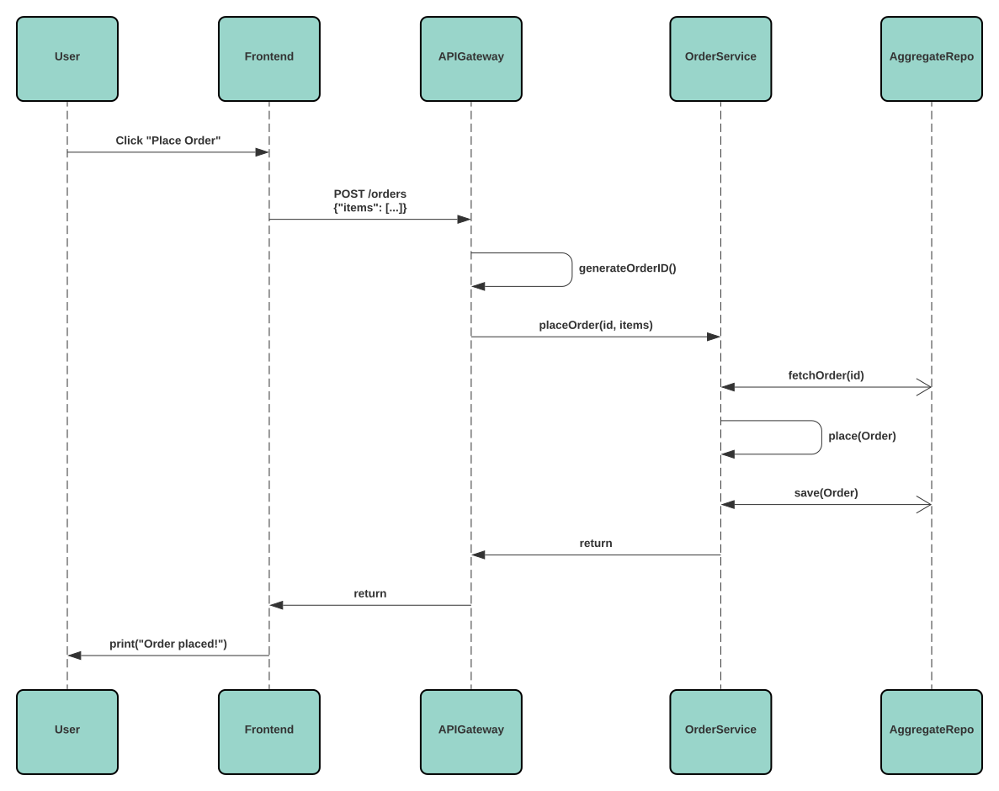

# Commands

## Introduction

Commands are actions that are performed (mostly) by/against an
[Aggregate](./aggregates.md). The simplest implementation of a Command for an
Aggregate would look like this:

```go
type Order struct {
    aggregate.Aggregate

    Items []Item
}

type Item struct {
    ID       uuid.UUID
    Quantity int
}

type ShoppingCart struct {
    Items []Item
}

type OrderPlacedData struct {
    Items []Item
}

func (o *Order) Place(cart ShoppingCart) error {
    if cart.Empty() {
        return errors.New("empty cart")
    }
    o.event("order.placed", OrderPlacedData{
        Items: cart.Items,
    })
    return nil
}

func (o *Order) place(evt event.Event) {
    data := evt.Data().(OrderPlacedData)
    o.Items = data.Items
}

func (o *Order) ApplyEvent(evt event.Event) {
    switch evt.Name() {
    case "order.placed":
        o.place(evt)
    }
}
```

With the above approach we can execute a the `PlaceOrder` Command directly on
the Aggregate itself (but we must not forget to persist the changes to the
Aggregate):

```go
func main() {
    // repo & cart are initialized
    var repo aggregate.Repository
    var cart ShoppingCart

    var o Order
    if err := repo.Fetch(context.TODO(), &o); err != nil {
        log.Fatalf("fetch order: %w", err)
    }

    if err := o.Place(cart); err != nil {
        log.Fatal(fmt.Errorf("place order: %w", err))
    }

    if err := repo.Save(context.TODO(), &o); err != nil {
        log.Fatal(fmt.Errorf("save order: %w", err))
    }
}
```

## Command Bus

Imagine the following service structure where the Frontend application wants to
execute a Command through an API Gateway service:

<div style="background: #fff; border-radius: 8px; padding: 1rem;">


</div>

In order to execute the `PlaceOrder` Command, the `API Gateway` needs to make
RPC calls directly to the `OrderService` and the OrderService then fetches the
`Order` from the `Aggregate Repository`, calls the Command on the Order
Aggregate and then saves the Aggregate back to the Repository. These are
redundant steps that must be implemented by every single Command Handler.

While it's perfectly fine to execute/handle Commands using this approach, a
dedicated `Command Bus` can provide and unify some key features like

- middlewares
- retries
- reporting/logging
- automated fetching & saving

and possibly many more.

## Command Bus as a Service

There are multiple ways to implement a Command Bus. One way is to add a
separate (micro)service which acts as the Command Bus. The other services then
dispatch Commands using an RPC client which connects to the Command Bus service.

While the above approach might be the most robust, it also has some
disadvantages:

- at least 1 extra service that must be setup/orchestrated
- "single" point of failure (if the Command Bus service crashes)
- (maybe) hard to implement
- logging must be implemented separately

## Event-driven Command Bus

Another communication approach between the Command Buses is the already
existing [Event Bus](./events.md#event-bus). Instead of using RPC calls the
Command Buses can publish Events to exchange messages.

This has some advantages over a separate Command Bus service:

- 100% distributed – no single point of failure
- simpler to implement
- simpler to setup
- builds on existing features
- the **$ value $** of the Command Events
  - [YouTube: Greg Young – Event sourcing](https://www.youtube.com/watch?v=I3uH3iiiDqY)

But of course there are some downsides, too:

- it's slower because
  - multiple Events need to be published in order to execute a single Command
  - of the asynchronous nature of the Event system
- more network throughput & higher CPU because
  - of the Event system (every Command Bus must filter out its received Events)
- harder to debug

### Detailed Design

- `User`: The caller who wants to dispatch a Command (may be a real-world user)
- `PubCommandBus`: The Command Bus through which the Command is dispatched
- `SubCommandBusN`: Two replicas of the same Command Bus (e.g. container replicas)

<div style="background: #fff; border-radius: 8px; padding: 1rem;">


</div>
