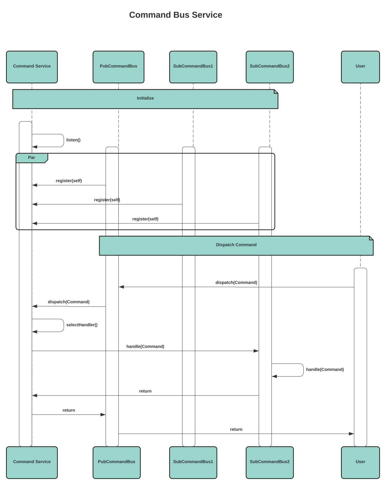

# Commands

## Introduction

Commands are actions that are performed (mostly) by/against an
[Aggregate](./aggregates.md).

For a hypothetical ecommerce application a typical
Command would be `PlaceOrder`. Where and how that Command is structured and
called in the actual code is not really important; the minimal approach would be
to just add a `Place` method directly on the `Order` Aggregate:

```go
// Order is the "order" Aggregate.
type Order struct {
    aggregate.Aggregate

    Items []Item
}

// Item is the item of an order.
type Item struct {
    ID       uuid.UUID
    Quantity int
}

// A ShoppingCart represents a shopping cart.
type ShoppingCart struct {
    Items []Item
}

// OrderPlacedBody is the Event body for a placed order.
type OrderPlacedBody struct {
    Items []Item
}

// Place "places" the order using the items from the provided ShoppingCart.
func (o *Order) Place(cart ShoppingCart) error {
    if cart.Empty() {
        return errors.New("empty cart")
    }
    // raise the "order.placed" event
    o.event("order.placed", OrderPlacedBody{
        Items: cart.Items,
    })
    return nil
}

// apply the "order.placed" event
func (o *Order) place(evt event.Event) {
    data := evt.Data().(OrderPlacedBody)
    o.Items = data.Items
}

func (o *Order) ApplyEvent(evt event.Event) {
    switch evt.Name() {
    case "order.placed":
        o.place(evt)
    }
}
```

With this approach we can execute the `PlaceOrder` Command directly on the
Aggregate itself (but we must not forget to persist the changes to the
Aggregate):

```go
func main() {
    // repo & cart are initialized
    var repo aggregate.Repository
    var cart ShoppingCart

    var o Order
    if err := repo.Fetch(context.TODO(), &o); err != nil {
        log.Fatalf("fetch order: %w", err)
    }

    if err := o.Place(cart); err != nil {
        log.Fatal(fmt.Errorf("place order: %w", err))
    }

    if err := repo.Save(context.TODO(), &o); err != nil {
        log.Fatal(fmt.Errorf("save order: %w", err))
    }
}
```

## Command Bus

A `Command Bus` is an alternative way of structuring Commands in an application.
Instead of calling Command directly on the Aggregate itself, it can be useful to
delegate this step to a separate entity – the Command Bus.

### Without Command Bus

Imagine the following service structure where the Frontend application wants to
execute a Command through an API Gateway service:

<div style="background: #fff; border-radius: 8px; padding: 1rem;">


</div>

In order to execute the `PlaceOrder` Command, the `API Gateway` needs to make
RPC calls directly to the `OrderService`. The OrderService then fetches the
`Order` from the `Aggregate Repository`, calls the Command on the Order
Aggregate and then saves the Aggregate back to the Repository. These are
redundant steps that must be implemented for every Command.

While it's perfectly fine to execute/handle Commands using this approach, a
dedicated `Command Bus` can provide and unify some key features like

- middlewares
- retries
- reporting/logging
- automated fetching & saving

and possibly many more.

### Command Bus Service

A Command Bus can be implemented in many ways. The first that comes to my mind
is to create separate service that must be run together with the rest of the
application services (e.g. as a service in a Docker Stack):

<div style="background: #fff; border-radius: 8px; padding: 1rem;">


</div>

While this approach might be the most robust, it has some disadvantages:

- hard to implement
  - Command Service has to manage connections to the buses and handle
    disconnects etc. gracefully
  - must recover from crashes
- at least 1 extra service that must be setup/orchestrated
  - at least 1 per host (!) server to be reliable
- "single" point of failure (if the Command Bus service crashes)
- (maybe) hard to implement (research needed)
- logging must be implemented separately (?)

### Event-driven Command Bus

Another way to implement the Command Bus is using Events with the already
existing [Event Bus](./events.md#event-bus). Instead of using RPC calls to an
explicit server, services communicate Commands through different Events:

**Components:**
- `User`: The caller who wants to dispatch a Command (may be a real-world user)
- `PubCommandBus`: The Command Bus through which the Command is dispatched
- `SubCommandBusN`: Two replicas of the same Command Bus (e.g. container replicas)

<div style="background: #fff; border-radius: 8px; padding: 1rem;">


</div>

This automatically provides some nice features:

- automatic "logging" of Commands through the Event Bus
- 100% distributed (no "master" Command Bus service)
- simpler to implement
- simpler to setup because it uses the event setup
- builds on existing features

But also some disadvantages:

- it's slower because
  - multiple Events need to be published in order to execute a single Command
  - of the asynchronous nature of the Event system
- maybe less reliable because it's asynchronous (?)
- more network throughput & higher CPU usage because
  - every Command Bus receives every Command Event, regardless of Command type
    (this could increase the pressure on **all** Command Buses noticeably
    depending on the amount of concurrently running Command Buses and amount of
    dispatches happening in the application.
- harder to debug
